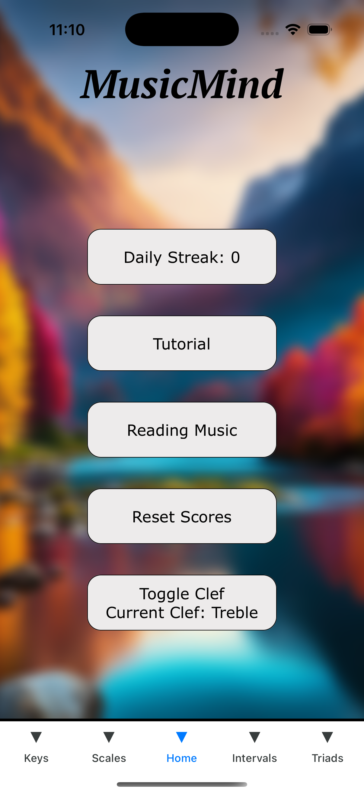
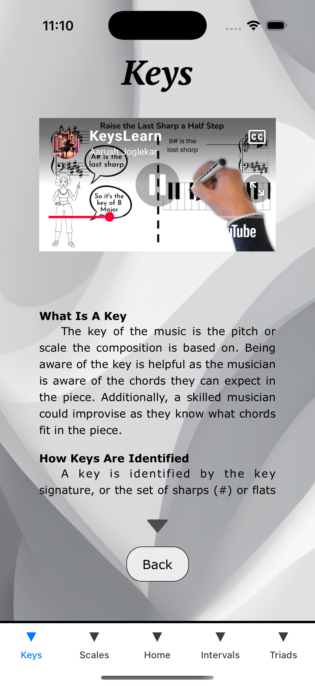
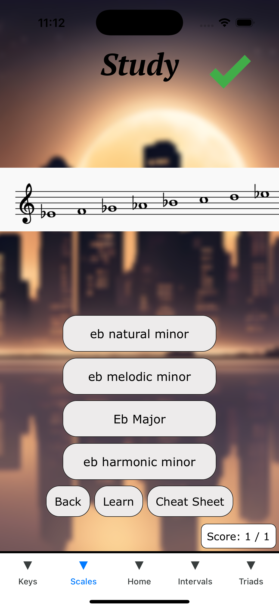
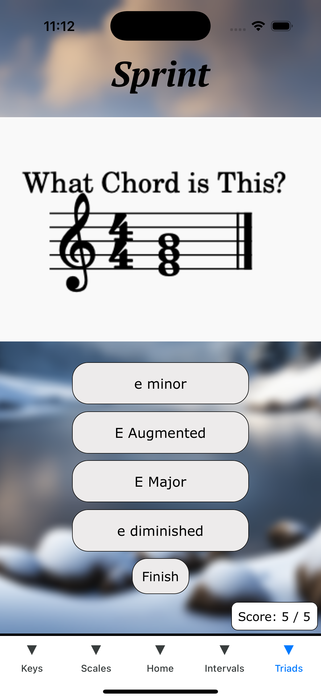
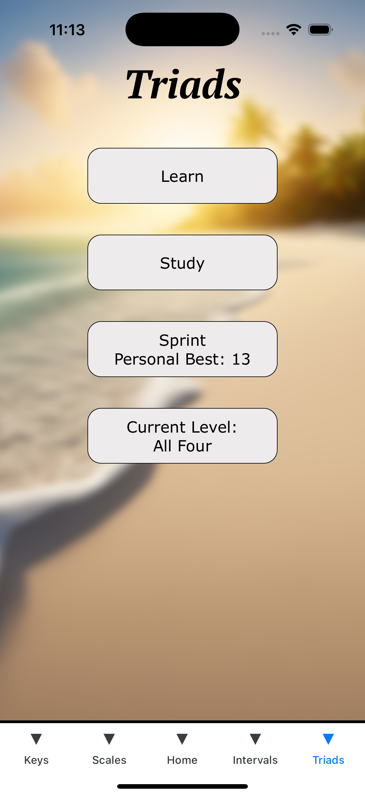
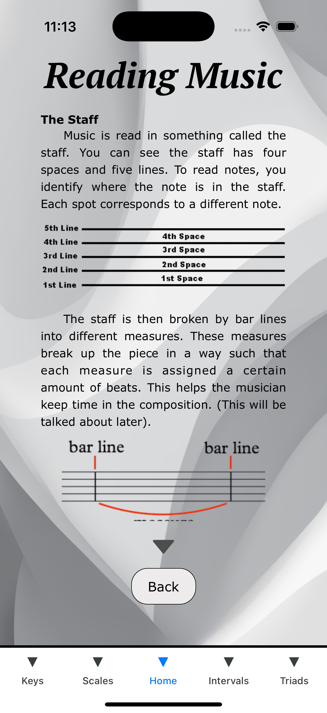
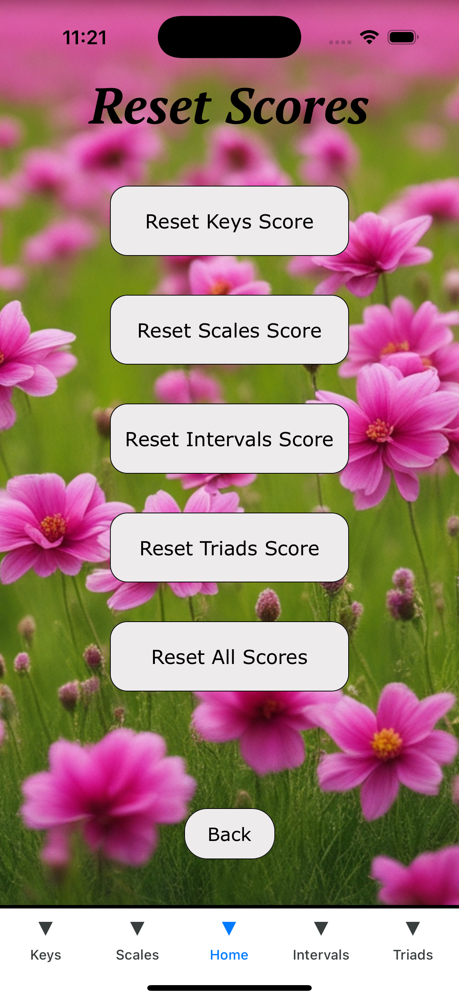
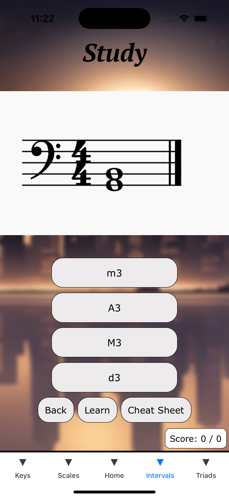

# MusicMind: Educational Music Theory App

### Description
MusicMind is a mobile app designed to help aspiring musicians improve their skills. The app covers the four essential concepts of music theory: Keys, Scales, Triads, and Intervals. To learn a topic, users can first read or watch a detailed explanation of the purpose, how to identify, and examples of the subject (learn). Users then have access to flashcards where they can practice (study) before tuning their abilities in speed flashcard rounds (sprint).

<b>Key Features:</b>
- Learn to read music
- Learn (text + videos)
- Study (flashcards)
- Sprint (timed tests)
- Personal High Scores
- Daily Streaks

### Tech Stack
- React Native
- Expo
- JavaScript

### Installation
#### App Store
Install MusicalMind on the [iOS App Store](https://apps.apple.com/us/app/musicalmind/id6745420780)

#### Running Locally
<ol>
  <li>Clone this repository</li>
  <li>Run: npx expo start</li>
  <li>Open with the XCode iPhone simulator (mac only) or an Android Simulator</li>
</ol>

### App Images
| | | |
|---|---|---|
|  |  |  |
|  |  |  |
|  | |  | | |

### Project Start Date:
March 13, 2024
